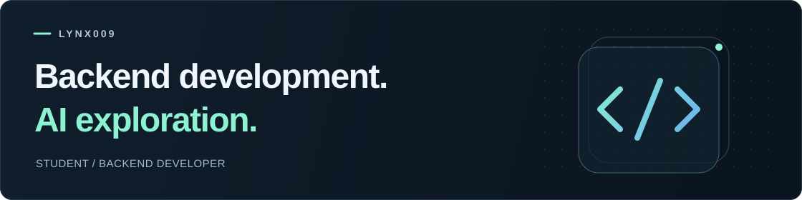

<picture>
  <source media="(prefers-color-scheme: dark)" srcset="./assets/profile-banner-dark.svg">
  
</picture>

# Hi, I'm lynx009.

I mainly use **Java, Python, and Go**. I'm interested in **AI agents** — how they collaborate to help people accomplish tasks and turn ideas into useful applications.

I'm a student. I enjoy learning and exploring whatever catches my interest.

[AI agents](#ai-agents) · [Open source](#open-source) · [Say hello](#say-hello)

## AI agents

I'm curious about how people and agents can work toward a shared goal — supporting one another, coordinating their efforts, and helping a task move forward.

## Open source

### [Apache HertzBeat](https://github.com/apache/hertzbeat)

**PMC member & contributor** / Observability

An open-source monitoring and alerting platform for applications, databases, and infrastructure.

[Website & docs ↗](https://hertzbeat.apache.org/)

## Say hello

For open-source discussions, start with an issue or pull request in the relevant project. For a direct conversation: [bli065709@gmail.com](mailto:bli065709@gmail.com).

---

lynx009 / Code, ideas, and room to explore.
